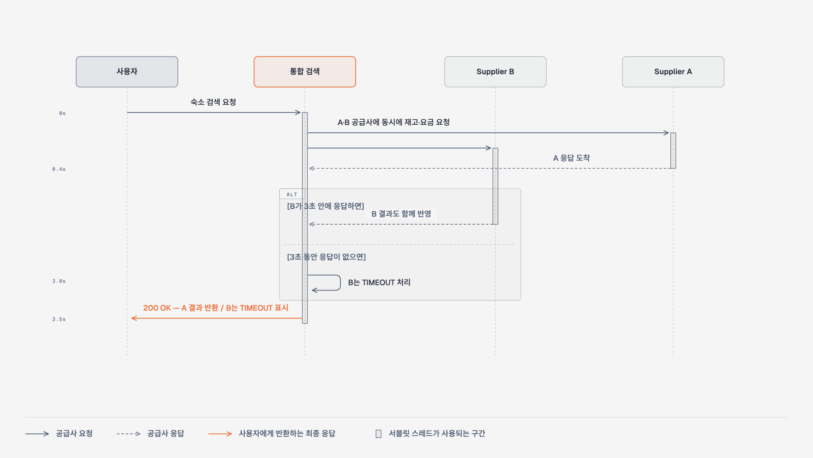
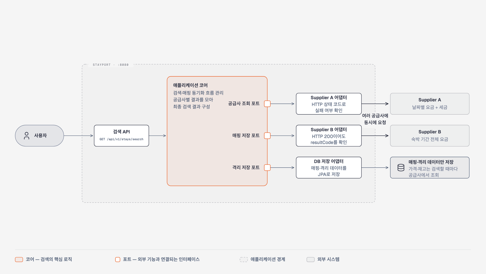
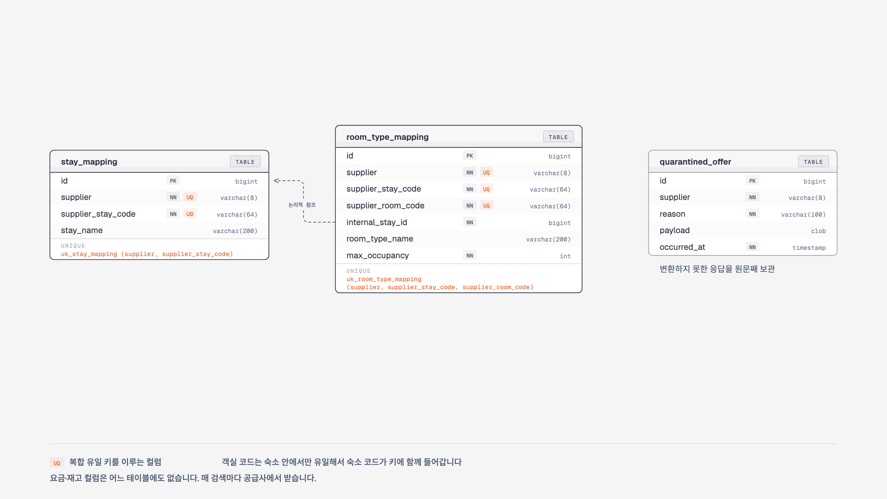

# stayport


서로 다른 스펙의 외부 숙박 공급사(Supplier A·B) API를 하나의 표준 상품 모델로 통합하고,
날짜·인원 기반 통합 검색을 제공하는 백엔드입니다.

공급사마다 요금 표현(날짜별 net+세금 vs 기간 총액 gross)도 실패 통보 방식(HTTP 상태 vs 본문
코드)도 제각각인데, 그 차이는 어댑터 계층에서 전부 흡수합니다. 클라이언트는 어느 공급사에서 온
상품인지 몰라도 같은 형태의 결과를 받습니다.

```
[사전] 공급사 숙소 목록 조회 → 내부 식별자 매핑 저장 (기동 시 1회 + 수동)
[검색] GET /api/v1/stays/search?checkIn&checkOut&adults&children
   → 매핑에서 보유 숙소를 공급사별 코드로 수집 (50개씩 분할)
   → 공급사 병렬 조회 → 표준 모델로 정규화 → 내부 식별자로 해석
   → 병합: 한쪽이 실패해도 나머지로 응답 + suppliers[]에 실패 사실 노출
```

| 🧪 테스트 | ⏱ 응답 예산 | 🧨 장애 재현 | 📈 부하 실측 |
|:---:|:---:|:---:|:---:|
| 64개 전부 green | 어떤 장애에도 **3.5초 안에 200** | 고장 스위치 [8종](#-장애를-직접-내보기) | [3,484 → 9.9 req/s](docs/load-test.md)<br>스레드 천장 증명 |

## 🛠 기술 스택

| 스택 | 이 프로젝트에서 맡는 일 |
|---|---|
| **Java 21** | 공급사 호출 결과를 "성공·일부 성공·실패" 세 가지로만 존재하게 타입으로 묶습니다 (`SupplierResult`) |
| **Spring Boot 4.1 · MVC** | 웹 계층은 평범한 동기 방식으로 두고, 공급사를 부르는 구간만 병렬로 처리합니다 |
| **Spring WebClient** | 공급사를 동시에 부르고 제한 시간을 거는 창구입니다 |
| **JPA · H2** | 공급사 코드와 내부 식별자의 매핑을 저장합니다. 같은 상품이 늘 같은 식별자를 받는 것을 DB 제약이 보장합니다 |
| **Resilience4j** | 계속 실패하는 공급사를 잠시 부르지 않습니다 |
| **SpringDoc** | 실행 중인 서버의 API 스키마를 `/swagger-ui.html`에 띄웁니다 |
| **ArchUnit** | "공급사 사정이 도메인으로 새지 않는다" 같은 약속을 테스트로 검사합니다 |
| **Gradle (Kotlin DSL)** | 빌드 설정도 컴파일 검사를 받게 Kotlin으로 씁니다 |

각 선택의 이유와 검토했다 버린 대안은 [docs/design.md](docs/design.md)에 있습니다.

외부 공급사는 실제로 존재하지 않으므로 스펙대로 만든 흉내 서버(9090)를 같이 띄웁니다.

## ⚡ 실행

JDK 21이 필요합니다. 그 외 설치할 것은 없습니다 (DB는 내장 H2).

```bash
# 터미널 1 — 공급사 흉내 서버 (9090)
./gradlew bootRun --args='--spring.profiles.active=mock'

# 터미널 2 — 본 앱 (8080). 기동하며 매핑 동기화가 한 번 돈다
./gradlew bootRun
```

검색:

```bash
curl "http://localhost:8080/api/v1/stays/search?checkIn=2026-09-01&checkOut=2026-09-04&adults=2&children=0"
```

API를 눌러 보려면 `http://localhost:8080/swagger-ui.html`을 열면 됩니다.

정상이면 상품 3건이 나옵니다. 그중 둘(내부 stayId 1·2)은 실제로는 같은 호텔인데 공급사가 달라
별개 상품으로 잡히고 B는 452,000원에 조식 포함, A는 429,000원에 조식 없음으로 나옵니다. 하나로
합치지 않은 판단은 docs/duplicate-matching.md에 있습니다.

테스트는 흉내 서버를 테스트 JVM 안에 직접 띄우므로 아무것도 미리 실행할 필요가 없습니다:

```bash
./gradlew test
```

## 🧨 장애를 직접 내보기

이 시스템에서 봐야 할 곳은 정상 경로가 아닙니다. 실패 경로가 핵심입니다. 한 공급사가 실패하거나
늦어도 이미 받은 다른 공급사의 결과는 버리지 않습니다. 공급사별 응답 제한은 3초, 전체 검색은
최대 3.5초 안에 200으로 마무리됩니다:



흉내 서버에 고장 스위치가 있으니 직접 꺼뜨려 보면서 확인하는 것이 가장 빠릅니다.

**① A 장애 (HTTP 503) — B의 결과만으로 응답합니다**

```bash
curl -X POST 'http://localhost:9090/control/a/mode?value=error'
curl "http://localhost:8080/api/v1/stays/search?checkIn=2026-09-01&checkOut=2026-09-04&adults=2&children=0"
# stays에는 B 상품 1건만, suppliers에는
#   A: FAILED, failures={SUPPLIER_ERROR:1} / B: OK
```

**② B 장애 — HTTP 200인데 실패입니다**

```bash
curl -X POST 'http://localhost:9090/control/a/mode?value=normal'
curl -X POST 'http://localhost:9090/control/b/mode?value=error'
```

B는 장애 상황에서도 HTTP 200에 `resultCode: E503`을 줍니다. 본문 코드를 확인하지 않으면 이
장애가 "검색 결과 0건"으로 조용히 처리됩니다. 위 검색을 다시 부르면 A 상품 2건과 함께
B가 FAILED로 표시되는 것을 볼 수 있습니다.

**③ 무응답이면 3초에 끊고 나머지로 응답합니다**

```bash
curl -X POST 'http://localhost:9090/control/b/mode?value=normal'
curl -X POST 'http://localhost:9090/control/a/mode?value=no-response'
time curl "http://localhost:8080/api/v1/stays/search?checkIn=2026-09-01&checkOut=2026-09-04&adults=2&children=0"
# 흉내 서버는 30초를 버티지만 응답은 3초 언저리에 온다. A는 FAILED(TIMEOUT), B는 OK
```

**④ 빈 응답 본문을 성공으로 처리하면 안 되는 경우**

```bash
curl -X POST 'http://localhost:9090/control/a/mode?value=empty-body'
# 다시 검색하면 A는 FAILED(PARSE_ERROR). 상태 200에 빈 본문이 오는 프로토콜 위반을
# "재고 0건"으로 오해하지 않는지 확인하는 스위치다
```

**⑤ 반복 실패하면 서킷이 열려 아예 부르지 않는다**

```bash
# A를 장애로 둔 채 여러 번 검색하면 최근 10건 중 절반이 실패한 시점에 서킷이 열린다
curl -X POST 'http://localhost:9090/control/a/mode?value=error'
for i in $(seq 1 6); do curl -s -o /dev/null "http://localhost:8080/api/v1/stays/search?checkIn=2026-09-01&checkOut=2026-09-04&adults=2&children=0"; done
curl -s 'http://localhost:8080/actuator/metrics/stayport.supplier.circuit.open?tag=supplier:A'
# 열린 뒤로는 A의 실패 사유가 SUPPLIER_ERROR가 아니라 CIRCUIT_OPEN이다 —
# 불러서 실패한 것과 아예 부르지 않은 것은 다른 사실이라 구분한다
```

**⑥ 속도 제한 — 두 공급사가 다른 방식으로 같은 말을 한다**

```bash
curl -X POST 'http://localhost:9090/control/a/mode?value=rate-limit'
curl -X POST 'http://localhost:9090/control/b/mode?value=rate-limit'
# A는 HTTP 429, B는 200에 resultCode E429. 둘 다 RATE_LIMIT 하나로 접힌다.
# AUTH·PARSE_ERROR와 달리 시간이 지나면 달라질 수 있는 실패라 재시도 대상이 된다(design.md §10)
```

**⑦ 복구**

```bash
curl -X POST 'http://localhost:9090/control/a/mode?value=normal'
# 열린 서킷은 10초 뒤 시험 호출을 통과시키고 닫힌다
```

**⑧ 매핑이 없는 상태와 공급사 장애의 구분**

흉내 서버를 장애로 둔 채 본 앱을 처음 기동하면(또는 `data/`를 지우고 재기동) 매핑이 빈 채로
뜹니다. 동기화가 실패해도 앱이 죽지는 않습니다. 이때 검색하면 공급사 상태가 `FAILED`가 아니라
`NO_MAPPING`으로 나옵니다. 공급사가 죽은 것과 우리가 아직 물어볼 목록을 못 만든 것은 원인도
다르고 클라이언트가 할 일도 달라서 구분합니다. 복구는:

```bash
curl -X POST http://localhost:8080/internal/sync
curl http://localhost:8080/internal/mappings   # 저장된 매핑 확인
```

위 시나리오는 전부 자동 테스트로도 고정돼 있습니다(`StaySearchTest`,
`SearchFailureIsolationTest`, `SearchCircuitBreakerTest`, `SupplierOffersTest`, `ChunkSplitTest`).

## 🧭 설계에서 정한 것들

읽는 사람이 보통 묻는 순서대로 적었습니다. 상세한 논증과 버린 대안은
[docs/design.md](docs/design.md)에 있습니다.

### 무엇을 표준으로 삼았나

두 공급사가 같은 객실을 다르게 말합니다. 어느 쪽 표현을 우리 표준으로 삼을지가 가장 먼저
정해야 할 것이었습니다.

**요금은 기간 전체 총액(세금 포함) 하나로 접었습니다.** A는 날짜별로 요금과 세금을 나눠 주고
B는 기간 총액만 줍니다. 양쪽에서 다 만들 수 있는 값이 이것뿐이라 공통 필드로 삼았습니다.
A만 주는 날짜별 분해는 버리지 않고 `dailyBreakdown` 선택 필드에 남겼습니다. 요금 분해는 한 번
버리면 총액에서 되돌릴 수 없기 때문입니다. 세금을 최상위 필드로 두는 안은 기각했는데, B에서
영원히 `null`이 되는 필드는 세금을 화면에 띄우는 클라이언트를 조용히 틀리게 만듭니다.

상품의 단위는 **숙소 > 객실 타입 두 단계**입니다. 두 공급사 모두 101호·102호 같은 개별 객실은
주지 않고 "디럭스 트윈이 몇 개 남았다"까지만 알려주기 때문입니다. 그래서 검색 결과 한 건은
숙소 × 객실 타입 × 검색 조건이 됩니다.

조식은 병합하지 않고 상품 속성(`breakfastIncluded`)으로 남겼습니다. 같은 객실이라도 공급사마다
값이 다를 수 있어서, 이걸 무시하고 가격만 비교하면 조건이 다른 상품을 비교하게 됩니다. 실제로
흉내 서버 데이터에 그런 쌍이 들어 있습니다(429,000원 조식 없음 vs 452,000원 조식 포함).

**예약할 수 없는 상품도 응답에 남기고 `availableRooms=0`으로 표시합니다.** 연박 재고는 날짜별
잔여의 최솟값이라 하루라도 0이면 예약이 안 됩니다. 이런 상품을 응답에서 빼버리면 클라이언트
입장에서 "그런 객실이 아예 없다"와 "있는데 만실이다"가 한 덩어리가 됩니다. 남기고 `bookable`
플래그를 같이 줍니다.

### 실패를 어떻게 다루나

외부 연동은 실패한다는 전제로 만들었습니다. 제한 시간은 세 층위로 나뉩니다 — 연결 1초, 공급사
호출 3초, 검색 전체 3.5초. 공급사 호출은 병렬이라 전체 예산은 합이 아니라 가장 느린 호출(3초)에
병합·직렬화 여유 0.5초를 더한 값입니다.

호출 제한은 Reactor `.timeout()` 하나로만 겁니다. read timeout을 겹쳐 걸면 어느 쪽이 발동했는지
로그에서 구분할 수 없습니다. 값은 전부 `application.yml`에 있어서 재배포 없이 바꿉니다.

이 값에는 다른 의미도 있습니다. MVC라 요청 하나가 응답까지 서블릿 스레드를 붙잡으므로, 제한
시간이 곧 스레드 점유 시간의 상한입니다. 공급사가 느려지면 우리 처리량 천장이 함께 내려간다는
뜻인데, 이건 나중에 실제로 재서 확인했습니다([docs/load-test.md](docs/load-test.md)).

공급사 실패는 HTTP 상태 코드로 표현하지 않고 응답 본문의 `suppliers[]` 상태로 내려줍니다.
요청이 성립하면 언제나 200입니다. 계약과 그 근거는 [docs/api.md](docs/api.md)에 있습니다.

### 무엇을 저장하고 무엇을 매번 묻나

**저장하는 것은 공급사 코드와 내부 식별자의 매핑뿐입니다.** 숙소 목록은 거의 안 바뀌고
재고·요금은 매 순간 바뀝니다. 정적인 것만 저장하고 휘발성은 검색할 때마다 공급사에 묻습니다.

동기화는 기동 시 한 번과 `POST /internal/sync` 수동입니다. 목록이 정적인데 갱신 주기를 정할
근거가 없어서 주기 스케줄러는 두지 않았습니다. 같은 공급사 상품이 항상 같은 내부 식별자로
돌아오는 것은 DB의 유일 제약이 보장합니다. 객실 타입 코드는 숙소 안에서만 유일해서, 객실
매핑의 키에는 숙소 코드가 함께 들어갑니다.

### 숙소가 늘어나면

공급사가 한 번에 받는 숙소 코드는 50개라 어댑터가 목록을 나눠 병렬로 부릅니다. 일부 묶음만
실패하면 받은 것은 버리지 않고 `PARTIAL`로 표시합니다.

언제 예산이 깨지는지는 세어볼 수 있습니다. 커넥션 풀이 공급사당 16개라 청크는 16개씩 나눠
나가고, 공급사가 300ms로 답하면 약 8,000개, 1초로 느려지면 약 2,400개에서 3.5초를 넘깁니다.
한계를 쥐고 있는 쪽은 우리 숙소 수보다 공급사의 응답 시간입니다. 유도 과정과 그 지점에서의
전환 설계는 design.md §5에 있습니다.

### 공급사를 하나 더 붙인다면

바뀌는 곳은 세 군데입니다. 공급사 식별자 상수 한 줄, `SupplierAdapter` 구현체 하나(응답
형식·변환·실패 판정까지 포함), 그리고 `application.yml`의 항목 하나. 검색과 병합, API 계층의
로직은 바뀌지 않습니다. 검색은 등록된 어댑터 목록을 순회할 뿐 공급사가 몇 개인지 모릅니다.

이 주장은 공급사별 응답 형식이 어댑터 밖으로 새지 않는다는 전제 위에 있고, 그 경계는 문서가
아니라 빌드가 지킵니다(`ArchitectureTest`의 규칙 5개).

## ✅ 응답에 담은 것

검색 응답이 무엇을 담는지 한눈에 보이도록 정리했습니다. 필드별 해석 규칙은
[docs/api.md](docs/api.md)에 있습니다.

| 담아야 할 것 | 응답 필드 | 비고 |
|---|---|---|
| 내부 숙소 식별자 · 숙소명 | `stayId` · `stayName` | 공급사 코드는 노출하지 않습니다 |
| 내부 객실 타입 식별자 · 객실 타입명 | `roomTypeId` · `roomTypeName` | 이름은 동기화 시점 스냅샷 |
| 최대 수용 인원 | `maxOccupancy` | 객실 1실 기준 |
| 예약 가능 객실 수 | `availableRooms` (+ `bookable`) | 요청 기간 전체를 예약할 수 있는 수 = min(날짜별 잔여) |
| 출처 공급사 | `supplier` | |
| 요금 | `price.totalAmount` · `currency` (+ `dailyBreakdown`) | 기간 전체 총액, 세금 포함 |
| 부분 실패 사실 | `suppliers[].status` · `failures` · `skippedItems` | 공급사별로 어디까지 받았는지 |

## 📚 문서

| 문서 | 내용 |
|---|---|
| [docs/design.md](docs/design.md) | 설계 결정과 근거, 버린 대안, 선택 항목 판단, 운영 전환 로드맵 |
| [docs/api.md](docs/api.md) | 검색 API 명세 — 상태 코드 계약, 필드 해석 규칙, 운영 엔드포인트 |
| [docs/load-test.md](docs/load-test.md) | 부하 측정 — 공급사 지연이 만드는 처리량 천장 (3,484 → 9.9 req/s), 재현 절차 |
| [docs/monitoring.md](docs/monitoring.md) | 연동 지표 — 노출되는 메트릭과 시나리오별 해석, 경보 설계 |
| [docs/duplicate-matching.md](docs/duplicate-matching.md) | 중복 숙소 — 합치지 않은 판단과 근거, 후보 탐지 방식 |
| [JOURNAL.md](JOURNAL.md) | 일자별 작업 기록과 시행착오 |

## 🏗 아키텍처

포트와 어댑터 구조입니다. 코어가 포트(주황 소켓)를 선언하고 어댑터가 바깥에서 꽂힙니다:



그림에서 먼저 볼 것은 포트의 위치입니다. 포트는 코어 쪽에 선언돼 있습니다. 어댑터 쪽에 두는
배치도 있지만 그러면 유스케이스가 공급사 사정을 알아야 합니다. 여기서는 유스케이스가 "무엇이
필요한가"만 선언하고 공급사 사정은 어댑터에서 끝납니다. A는 실패를 HTTP 상태로, B는 200 속 응답
코드로 말하지만 그 차이는 어댑터 밖으로 새지 않습니다.

공급사 호출은 병렬이고 각각 3초 제한이 걸립니다. 한쪽 실패는 그 공급사의 상태로만 남습니다.

DB에는 매핑과 격리 데이터만 있습니다. 가격·객실 정보는 저장하지 않고 매번 실시간으로 조회합니다.
이 경계들은 ArchUnit 규칙 5개로 빌드에서 강제됩니다(`ArchitectureTest`).

패키지 배치:

```
io.github.jys0615.stayport
├─ api/           검색 API, 응답 DTO, 단일 오류 스키마 (인바운드)
├─ domain/        표준 상품 모델, 매핑·격리 엔티티 — 공급사를 모른다
├─ application/   검색·동기화 유스케이스, 아웃바운드 포트
├─ adapter/
│  ├─ suppliera/  A 전용 DTO·변환·실패 판정 (HTTP 상태)
│  ├─ supplierb/  B 전용 DTO·변환·실패 판정 (200 + resultCode)
│  └─ persistence/ 매핑·격리 저장소 JPA 구현
├─ infra/         WebClient 구성, 설정 프로퍼티
└─ mock/          공급사 흉내 서버 (mock 프로파일 전용 — 운영 코드가 아니다)
```

저장하는 것은 매핑뿐입니다. 테이블 세 개에 요금과 재고 컬럼이 하나도 없는 것이 이 스키마의
요지입니다.



객실 코드는 숙소 안에서만 유일합니다. `A-10023`과 `A-10077`이 둘 다 `DLX-TWN`을 쓰기 때문에,
객실 매핑의 유일 키에는 숙소 코드가 함께 들어가야 서로 다른 내부 식별자를 받습니다. 같은 공급사
상품이 다시 조회될 때 항상 같은 내부 식별자로 돌아오는 것도 이 제약이 보장합니다.
